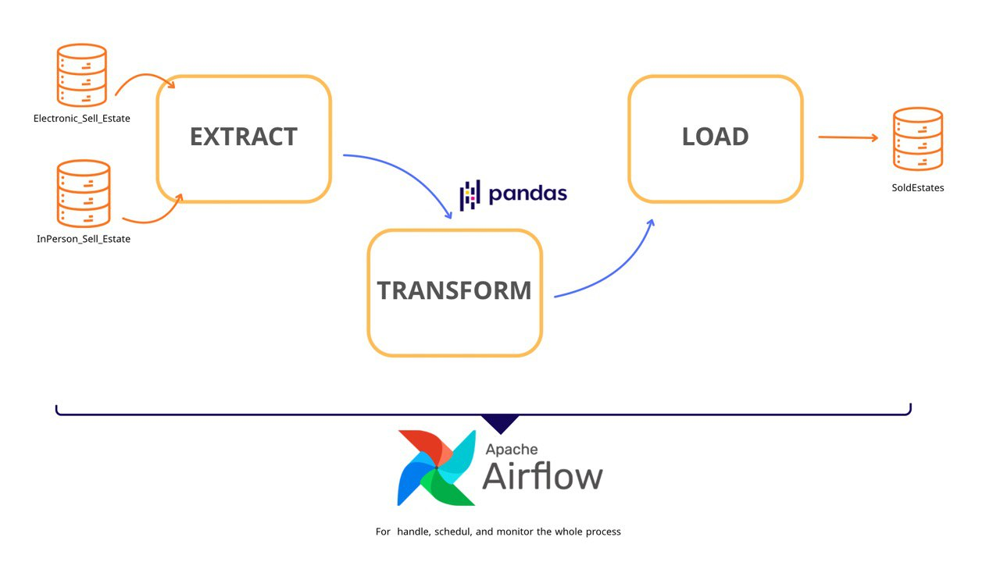
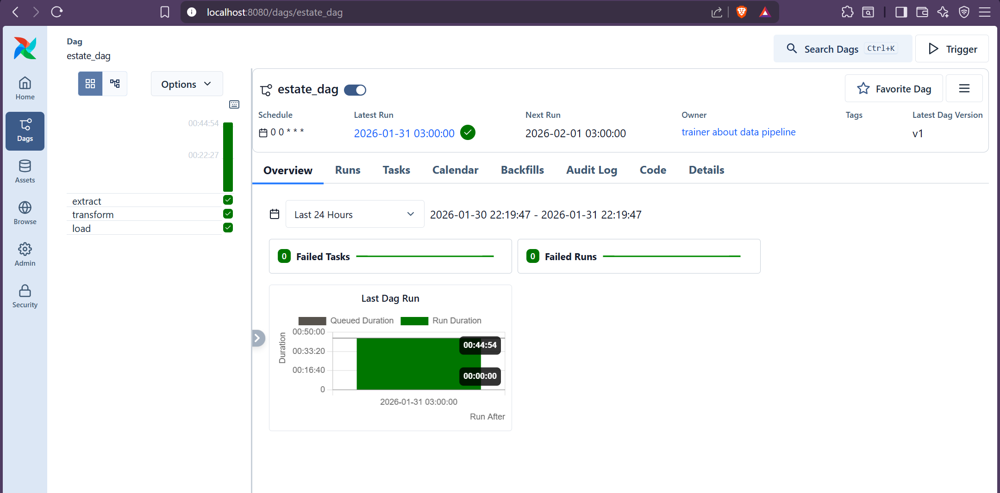
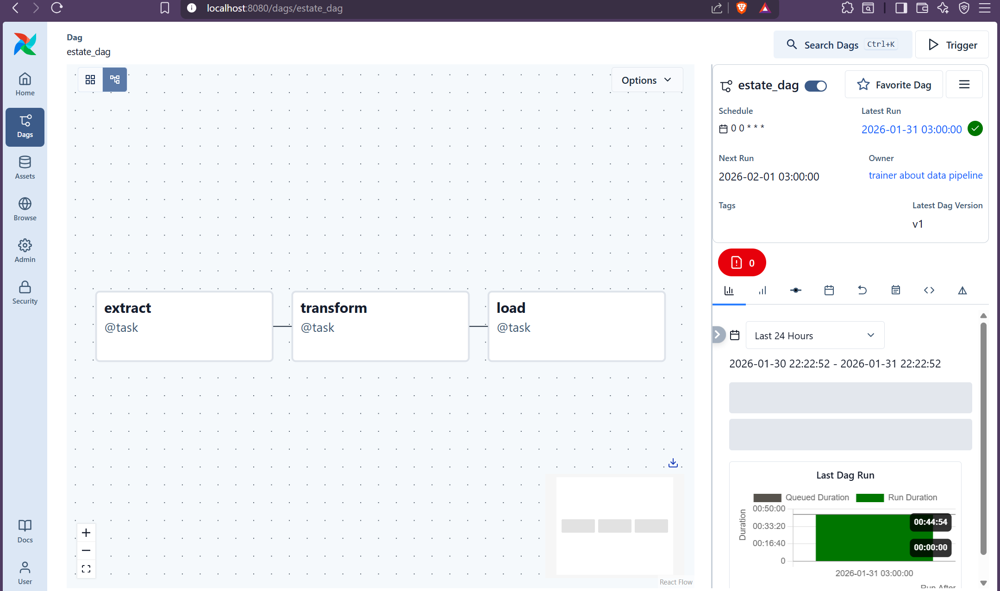
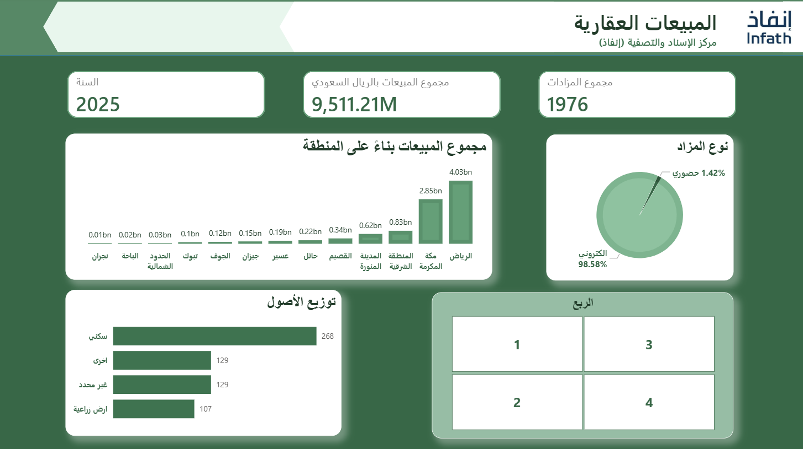
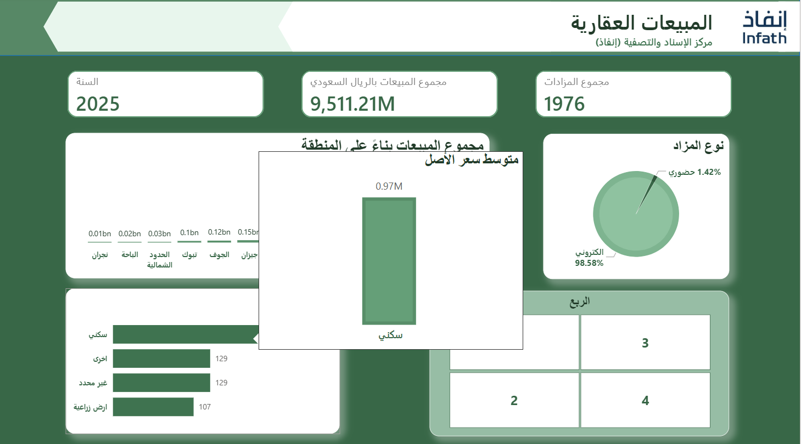

## Project: Create Data Pipeline with Apache Airflow
Create data pipelines with open-source software that handle data processes, make the process automatically and schedule. The data used about Estate Auction in Saudi Arabia in 2025. 
The version of Apache Airflow (3.1.6) 
The project continues to create data pipelines with python only.

 

---

## Scenario:
> **Warning:** the scenario is fake.
 
“Infath” decided at end 2025 to gather all data into one database to analysis them and make better decisions for 2026 In Sha Allah. The problem is data stored into many places, so the team just want to gather data into 2 places: online and in-person, at this time it needs to create daily scheduled data pipeline that is based on ETL process.

 

---
## Data Flow Diagram
 

  

---
## Processes
The project consists of ETL process, get benefit from abilities of Apache Airflow and do it automatically with explore errors and examine logs. The real process was written into `dag.py` file:  
-	**Extract:** Extract data from two databases, one related to online estate auction, and another for in-person estate auction, then gather them into Dataframe using pandas library. 
-	**Transform:** Check from null values and fill them, the string filled by “none” or “لا يوجد”, number of estates, assets, total sales by the median of data because they have outliers (no nature distribution), the year filled by 2025, and quarter by zero (not sure it related to which quarter of 2025, that may lead to some conflicts, for example: if the unknown quarter has high total sell, then it may lead to affect to the data related to same quarter, the main problem here is that get wrong analysis with unwisdom decision). Also normalize data to have the same letter “Alef” ( ا ) at any place of word, and “Taa Marbutah” ( ة ) at end of word with remove Arabic diacritical marks.
-	**Load:** Load all data into one database which is “SoldEstate” to get benefit from them even for visualize by Power BI or predictions by ML.

  
---

## The Schedule
The process is scheduled to be done every day until the handle of data is done.

 

--- 

## Data Source
Got data from Saudi open data platform. 
 
[Online data files](https://open.data.gov.sa/ar/datasets/view/3d44d00e-5aa6-4937-981d-bd0548606109/resources)

 

[In-Person data files](https://open.data.gov.sa/ar/datasets/view/a7fe58bf-657d-4446-88b1-a3686a6c7e94/resources)

 

---

## Tools Used for Project

-	**Docker:** To download Apache Airflow.
-	**Apache Airflow:** To handle data pipeline and automate.
-	**VScode:** The main environment and platform that hold all files and execute python codes. 
-	**SQLite:** For databases.
-	**Saudi Open data Platform:** To get data for scenario.

 

---

## How to Download Apache Airflow into Docker?

By the terminal of VScode, write command:  
`       curl -LfO 'https://airflow.apache.org/docs/apache-airflow/3.1.6/docker-compose.yaml'                                                                                                `
  

If you had a problem with ` curl -LFo ` – It appear if you use VScode version of Windows, because the terminal use PowerShell that cannot understand the command, write before the above command:  
`      Remove-item alias:curl                                                                                                                                                                ` 
  

Then make directories:  
 `    mkdir   ./logs  ./dags   ./config   ./plugins                                                                                                                                          `

 

--- 
## Images From The Process
<dr>
-	Dag interface in Apache Airflow:
  

    
  
-	Tasks flow: 

  

-	SoldEstate database after done the process:

 

--- 

## Dashboard
I made a simple, quick dashboard to visualize data and get whole picture about it.
 

  

